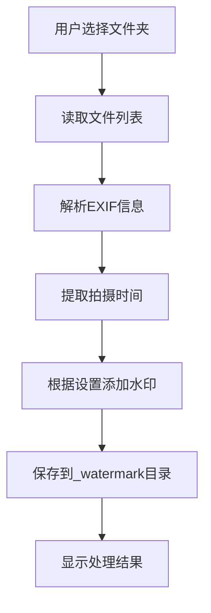

# 水印添加工具 PRD

## 1. 项目概述

水印添加工具是一个基于Web的应用程序，允许用户为图片文件批量添加基于拍摄时间的文本水印。用户可以选择一个包含图片的文件夹，程序会自动读取图片的EXIF信息中的拍摄时间，并将该时间作为水印添加到图片上。

## 2. 功能需求

### 2.1 核心功能

#### 2.1.1 文件夹选择
- 用户可以选择一个包含图片文件的文件夹
- 支持常见的图片格式（JPG、JPEG、PNG等）

#### 2.1.2 EXIF信息读取
- 读取图片文件的EXIF信息
- 提取拍摄时间信息
- 格式化时间为年月日格式作为水印文本

#### 2.1.3 水印设置
用户可以自定义以下水印参数：
- 字体大小
- 字体颜色
- 水印在图片上的位置：
  - 左上角
  - 顶部居中
  - 右上角
  - 居中
  - 左下角
  - 底部居中
  - 右下角

#### 2.1.4 图片处理与保存
- 在原始图片上绘制文本水印
- 将添加水印后的图片保存到新文件夹
- 新文件夹命名为原目录名+"_watermark"，并作为原目录的子目录

### 2.2 非功能需求

#### 2.2.1 性能要求
- 支持批量处理多张图片
- 处理过程应有进度提示

#### 2.2.2 用户体验
- 简洁直观的用户界面
- 清晰的操作指引
- 实时预览水印效果（可选功能）

## 3. 技术要求

### 3.1 前端技术栈
- Vue 3
- TypeScript
- HTML5 File API
- Canvas API 用于图片处理

### 3.2 第三方库
- exif-js 或 exifr 用于读取EXIF信息

## 4. 界面设计

### 4.1 主界面元素
1. 文件夹选择按钮
2. 水印设置面板：
   - 字体大小滑块
   - 字体颜色选择器
   - 位置选择器
3. 处理按钮
4. 进度显示
5. 处理结果提示

## 5. 数据流程

## 6. 错误处理

- 文件夹为空或不包含图片文件时的提示
- EXIF信息不存在或无法读取时的处理
- 文件读写权限问题的处理
- 浏览器兼容性问题的处理