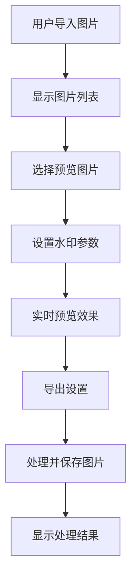

# 水印添加工具 PRD (V2)

## 1. 项目概述

水印添加工具是一个基于Web的应用程序，允许用户为图片文件添加文本或图片水印。用户可以选择单张或多张图片，自定义水印内容、样式和位置，并将处理后的图片保存到指定文件夹。

## 2. 功能需求

### 2.1 文件处理

#### 2.1.1 导入图片
- 支持单张图片拖拽或通过文件选择器导入
- 支持批量导入，可一次性选择多张图片或直接导入整个文件夹
- 在界面上显示已导入图片的列表（缩略图和文件名）

#### 2.1.2 支持格式
- 输入格式：必须支持主流格式，如 JPEG, PNG。强烈建议支持 BMP, TIFF。PNG格式必须支持透明通道
- 输出格式：用户可选择输出为 JPEG 或 PNG

#### 2.1.3 导出图片
- 用户可指定一个输出文件夹。为防止覆盖原图，默认禁止导出到原文件夹
- 提供导出文件命名规则选项：
  - 保留原文件名
  - 添加自定义前缀（如 wm_）
  - 添加自定义后缀（如 _watermarked）
- 对于 JPEG 格式，提供图片质量（压缩率）调节滑块（0-100）（可选高级功能）
- 导出时允许用户调整图片尺寸（如按宽度、高度或百分比缩放）（可选高级功能）

### 2.2 水印类型

#### 2.2.1 文本水印
- 内容：用户可自定义输入任意文本
- 字体：可选择系统已安装的字体、字号、粗体、斜体（可选高级功能）
- 颜色：提供调色板让用户选择字体颜色（可选高级功能）
- 透明度：可调节文本的透明度（0-100%）
- 样式：可添加阴影或描边效果，以增强在复杂背景下的可读性（可选高级功能）

#### 2.2.2 图片水印（可选高级功能）
- 用户可从本地选择一张图片（如Logo）作为水印
- 必须支持带透明通道的 PNG 图片
- 缩放：可按比例或自由调整图片水印的大小
- 透明度：可调节图片水印的整体透明度（0-100%）

### 2.3 水印布局与样式

#### 2.3.1 实时预览
- 所有对水印的调整都应在主预览窗口中实时显示效果
- 用户可以点击图片列表切换预览不同的图片

#### 2.3.2 位置
- 预设位置：提供九宫格布局（四角、正中心），用户可一键将水印放置在这些位置
- 手动拖拽：用户可以直接在预览图上通过鼠标拖拽水印到任意位置

#### 2.3.3 旋转
- 提供一个滑块或输入框，允许用户以任意角度旋转水印（可选高级功能）

### 2.4 配置管理

#### 2.4.1 水印模板
- 用户可以将当前的水印设置（包括水印内容、字体、颜色、位置、大小、透明度等所有参数）保存为一个模板
- 用户可以加载、管理和删除已保存的模板
- 程序启动时可自动加载上一次关闭时的设置或一个默认模板

## 3. 技术要求

### 3.1 前端技术栈
- Vue 3
- TypeScript
- HTML5 File API
- Canvas API 用于图片处理

### 3.2 第三方库
- exif-js 或 exifr 用于读取EXIF信息

## 4. 界面设计

### 4.1 主界面元素
1. 文件导入区域：
   - 拖拽区域
   - 文件选择按钮
   - 批量导入按钮
2. 图片列表面板：
   - 缩略图展示
   - 文件名显示
3. 预览窗口：
   - 实时预览水印效果
   - 支持切换预览图片
4. 水印设置面板：
   - 水印类型选择（文本/图片）
   - 文本水印设置（内容、字体、颜色、透明度等）
   - 图片水印设置（选择、缩放、透明度等）
   - 位置设置（预设位置、手动拖拽）
   - 旋转设置
5. 导出设置面板：
   - 输出格式选择
   - 输出文件夹选择
   - 命名规则设置
   - JPEG质量调节
   - 图片尺寸调整
6. 模板管理面板：
   - 模板保存
   - 模板加载
   - 模板管理
7. 处理按钮
8. 进度显示
9. 处理结果提示

## 5. 数据流程

## 6. 错误处理

- 文件格式不支持时的提示
- 导出路径与原路径相同时的处理
- EXIF信息不存在或无法读取时的处理
- 文件读写权限问题的处理
- 浏览器兼容性问题的处理